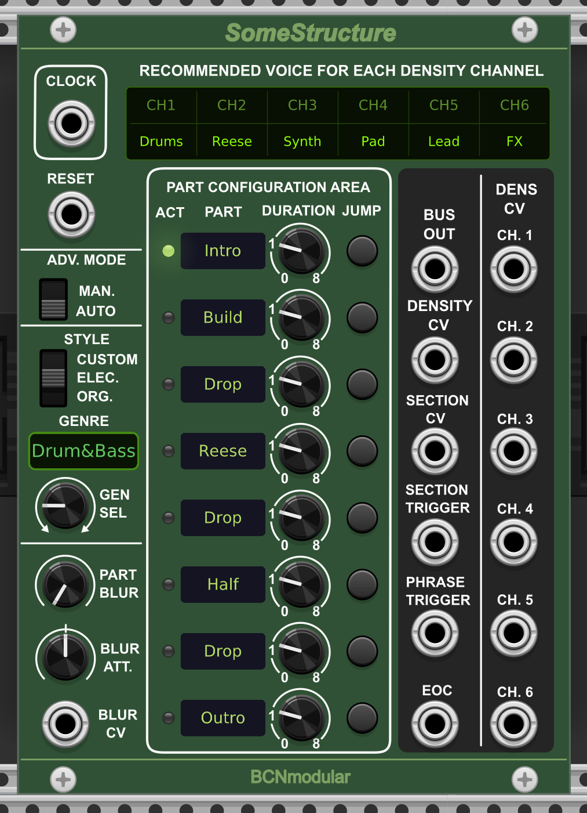

# BCNmodular

VCV Rack plugins by BCNmodular (Barcelona, Catalonia, SPAIN).

By Santi Fort

---

## Modules

- [Maestro](#maestro) — Probabilistic Voice Router, Arranger, Mixer, Sequencer & Trigger Generator
- [SomeStructure](#somestructure) — Arrangement Structure Generator for Maestro

---

## Maestro


**Probabilistic Voice Router, Arranger, Mixer, Sequencer & Trigger Generator**

Maestro is an arrangement tool for VCV Rack that brings controlled randomness to your patches. Instead of building fully deterministic sequences, Maestro acts as an intelligent conductor, deciding which voices play at each moment based on weighted probability, density control, and musical timing.

### The concept

In modular synthesis, achieving musical structure while preserving randomness typically requires combining many modules. Maestro consolidates this into a single module: connect your voices, set their relative probabilities, and let Maestro decide who plays at each evaluation point.

### Features

- **6 independent channels** gate, clock, audio or trigger signals
- **Three channel modes** Trigger (T), Gate (G) and Fade (F) selectable per channel
- **Weighted probability per channel** each channel has its own probability knob and CV crossfade input
- **Density control** set how many voices are active at once, with CV crossfade modulation
- **Randomness control** from fully deterministic (exact number of voices) to fully random (gaussian distribution)
- **Bar-based evaluation** evaluations happen every N bars (1, 2, 4, 8, 16), not beats
- **Skip probability** chance of keeping the current state instead of re-evaluating
- **Fade In / Fade Out** smooth transitions for audio channels (0 to 10s)
- **Polyphonic support** all channels process polyphonic signals
- **Channel labels** editable 4-character labels per channel (double-click to edit)
- **Reset input** resets the bar counter or forces an immediate evaluation
- **Active voices CV output** CV proportional to the number of active voices
- **RGB LEDs** color-coded status per channel and mode
- **Voltage indicator** output jacks show signal level

### Channel modes (T/G/F switch)

Each channel has an independent mode switch:

| Mode | Description |
|------|-------------|
| T (Trigger) | Sends a short pulse (configurable 1 to 10ms) at 10V when the channel is selected. LED is blue when waiting, flashes white on trigger |
| G (Gate) | Instant on/off. Passes the input signal while the channel is active |
| F (Fade) | Smooth fade in and fade out (0 to 10s). Ideal for audio signals |

### LED colors

| Color | Meaning |
|-------|---------|
| Blue | Channel in Trigger mode, waiting |
| White flash | Trigger fired |
| Green | Channel active (Gate or Fade mode) |
| Yellow | Fade transition in progress |
| Red | Channel inactive (Gate or Fade mode) |

### Context menu options

- **Prob CV crossfade mode** Normal (Linear), Biased (Quadratic) or Hard (Cubic) — controls how strongly the Prob CV overrides the knob
- **Beats per bar** set time signature (2 to 8 beats per bar, default 4)
- **Min active voices** set a minimum number of active voices to prevent full silence
- **Skip CV mode** Probabilistic (CV sets probability) or Binary (CV acts as on/off)
- **Skip mode** Global (skip entire evaluation) or Per channel (each channel decides independently)
- **Reset input mode** Reset bars or Force evaluate (triggers immediate evaluation without resetting the counter)
- **Default input voltage** select 1V (gate/trigger) or 10V (CV/audio) for unconnected inputs
- **Active output CV mode** proportional to active tracks, or absolute (1.66V per voice)
- **Trigger duration** configurable pulse length: 1ms, 2ms, 5ms (default) or 10ms

### Controls

#### Global (Row 1)
| Control | Description |
|---------|-------------|
| CLOCK | Clock/trigger input drives the beat counter |
| ACTIVE TRACKS | Number of channels participating in evaluation (1 to 6) |
| TRACK DENS | Base number of active voices |
| TRK DENS XFADE | Crossfade between Track Density knob and CV (0 = knob, 1 = CV) |
| DENS CV | CV input for density modulation |
| DETERM/RANDOM | Randomness amount (left = deterministic, right = random) |
| OUT CH. AMOUNT | CV output proportional to active voices (0 to 10V) |

#### Timing (Row 2)
| Control | Description |
|---------|-------------|
| RESET | Resets bar counter or forces evaluation (see context menu) |
| LENGTH | Evaluation period in bars (1, 2, 4, 8, 16) |
| LEN CV | CV input for length (overrides knob) |
| SKIP PROB | Probability of skipping an evaluation (0 = never, 1 = always) |
| SKIP CV | CV input for skip probability |
| FADE IN | Fade-in time for audio channels (0 to 10s) |
| FADE OUT | Fade-out time for audio channels (0 to 10s) |

#### Per channel (x6)
| Control | Description |
|---------|-------------|
| LABEL | Editable 4-character channel name (double-click) |
| INPUT | Signal input: gate, clock, audio or trigger source |
| PROB | Base probability for this channel |
| PROB XFADE | Crossfade between Prob knob and CV (0 = knob, 1 = CV) |
| PROB CV | CV modulation for probability |
| T/G/F | Mode switch: Trigger, Gate or Fade |
| LED | RGB status indicator (see LED colors above) |
| OUT | Signal output |

### Prob CV crossfade explained

The PROB XFADE knob controls the balance between the PROB knob and the PROB CV input:

- **XFADE = 0** → the knob value is used entirely (CV has no effect)
- **XFADE = 0.5** → the result is a blend of knob and CV
- **XFADE = 1** → the CV value is used entirely (knob has no effect)

This also applies to TRACK DENSITY via the TRK DENS XFADE knob.

The **Prob CV crossfade mode** (context menu) controls how the crossfade responds:
- **Normal (Linear)** — standard, linear response. Best for manual use without SomeStructure
- **Biased (Quadratic)** — emphasises differences between channels. Good balance
- **Hard (Cubic)** — highly deterministic. Recommended when using SomeStructure

### Typical use cases

**Arrangement tool** Connect sequencers or voice outputs to Maestro's inputs. Use CLOCK from your master clock and set LENGTH from 1 to 16 bars. Maestro will periodically decide which voices are active, creating evolving arrangements that never repeat exactly.

**Performance tool** Automate DENSITY with a slow LFO, any evolving signal generator, or MIDI CC to gradually bring voices in and out. Use the crossfade knob to control how much the CV affects the density in real time. Use RESET in Force evaluate mode to manually trigger a new arrangement at any moment.

**Trigger sequencer** Set channels to Trigger mode and leave inputs unconnected. Maestro will fire 10V trigger pulses to burst generators, envelopes, or any trigger-sensitive module.

**Gate sequencer** Leave inputs unconnected (defaults to 1V) and use outputs in Gate mode to trigger gates, switches, or other modules.

**Mixer** Connect audio signals and use Fade mode with longer fade times for smooth crossfades between voices.

### Tips

- Set DETERM/RANDOM fully left for exact voice counts, fully right for maximum variation
- Use MIN ACTIVE VOICES in the context menu to avoid complete silence
- In 3/4 time, set Beats per bar to 3 in the context menu
- Longer FADE OUT times preserve natural reverb tails when closing audio channels
- Use RESET in Force evaluate mode during performance to manually change the arrangement
- In Trigger mode, set trigger duration to 10ms for modules that need longer pulses
- Connect SomeStructure SECTION TRIGGER → Maestro RESET (Force evaluate) for perfectly timed evaluations

---

## SomeStructure



**Arrangement Structure Generator for Maestro**

SomeStructure is a companion module for Maestro. While Maestro handles probabilistic voice routing at the bar level, SomeStructure provides the higher-level musical structure: it defines which sections a track passes through (Intro, Build, Drop, Outro...) and how the voice density and roles should evolve across those sections.

The combination of both modules allows you to create generative tracks with real musical form — sections that feel intentional, with smooth or abrupt transitions, all while preserving Maestro's natural variation within each section.

### The concept

SomeStructure works with musical **styles** (presets for genres like Techno, DnB, Jazz, Ambient...) that define 8 sections with their density targets and recommended voice roles. As the track advances, SomeStructure sends CV signals to Maestro, telling it how many voices should be active and which channels should be prioritised.

> SomeStructure provides the structure. Maestro provides the life.

### Features

- **8 configurable sections** with editable name, duration and jump button
- **3 style categories** Electronic, Organic and Custom
- **11 built-in styles** Techno, Drum & Bass, EDM, IDM, Synthwave, Dubstep, Prog Rock, Jazz, Ambient, Minimal, Dub
- **3 user-editable Custom styles** (A, B, C) saved per patch or preset
- **Recommended voice display** shows the suggested instrument for each channel based on the active style
- **BCNmodular Bus output** 16-channel polyphonic CV carrying all structural parameters
- **Individual outputs** Density CV, Section CV, Section Trigger, Phrase Trigger, EOC, and role weights CH1–CH6
- **Blur control** adds musical looseness to section transitions
- **Auto/Manual mode** automatic progression or manual jump control
- **Duration per section** Skip (0), 1, 2, 4 or 8 bars per section
- **Jump buttons** jump to any section immediately (waits for the next bar boundary)
- **MIDI-mappable** jump buttons can be assigned to MIDI pads via VCV Rack's built-in MIDI mapping

### Style categories

| Category | Styles |
|----------|--------|
| Electronic | Techno, Drum & Bass, EDM, IDM/Experimental, Synthwave, Dubstep |
| Organic | Prog/Symphonic Rock, Jazz, Ambient, Minimal, Dub |
| Custom | Custom A, Custom B, Custom C (user-editable) |

### Outputs

| Output | Description |
|--------|-------------|
| BUS OUT | 16-channel polyphonic BCNmodular Bus |
| DENSITY CV | Density target for the current section (0–10V = 0–6 voices) |
| SECTION CV | Current section number as CV |
| SECTION TRIGGER | Trigger pulse at every section change |
| PHRASE TRIGGER | Trigger pulse every N bars (configurable, default 1) |
| EOC | End of cycle trigger (after section 8) |
| CH.1–CH.6 | Individual role weight CV per channel (0–10V) |

### BCNmodular Bus channels

| Channel | Content |
|---------|---------|
| 1 | Density target |
| 2 | Randomness blend |
| 3 | Length override |
| 4 | Section blur |
| 5 | Section CV |
| 6 | Section trigger |
| 7 | Phrase trigger |
| 8 | End of cycle |
| 9 | Tension CV |
| 10 | Protocol version (1.0) |
| 11–16 | Role weight CH1–CH6 |

### Controls

| Control | Description |
|---------|-------------|
| CLOCK | Clock input (shared with Maestro) |
| RESET | Resets to section 1 |
| ADV. MODE | Auto (automatic progression) or Manual (only jump buttons advance) |
| STYLE | Category switch: Electronic / Organic / Custom |
| GENRE | Selects the style within the category |
| GEN SEL | Genre selection knob |
| PART BLUR | Adds looseness to section durations |
| BLUR ATT. | Attenuverter for Blur CV |
| BLUR CV | CV input for blur amount |
| ACT | LED indicating active section |
| PART | Editable section name label |
| DURATION | Section duration: Skip / 1 / 2 / 4 / 8 bars |
| JUMP | Jump to this section (waits for next bar) |

### Custom styles

In Custom mode, each section can be configured via the context menu:

- **Name** — section type (Intro, Vers, PreCh, Chorus, Bridge...)
- **Density** — target number of active voices (1–6)
- **Voice weights** — role weight per channel (0.0 / 0.1 / 0.4 / 0.7 / 1.0)
- **Recommended voice names** — label each channel with an instrument name

Custom configurations are saved per patch and per preset.

### Context menu

- **Beats per bar** — time signature (2–8, default 4)

### Using SomeStructure with Maestro

**Basic connection (minimum setup):**
1. Connect SomeStructure **DENSITY CV** → Maestro **DENS CV** (set TRK DENS XFADE to 1)
2. Connect SomeStructure **CH.1–CH.6** → Maestro **PROB CV** CH1–CH6 (set PROB XFADE to 1)
3. Set Maestro **Prob CV crossfade mode** to **Hard (Cubic)** for best results

**Recommended additional connection:**
- Connect SomeStructure **SECTION TRIGGER** → Maestro **RESET** (set Reset mode to Force evaluate)
- This ensures Maestro re-evaluates immediately when a new section starts

**Maestro settings for SS-driven mode:**
- TRACK DENS knob: any value (overridden by DENSITY CV)
- PROB knobs: 0.5 (neutral, overridden by CH CV)
- DETERM/RANDOM: fully left (deterministic)
- Prob CV crossfade mode: Hard (Cubic)

**Understanding the system:**
- SomeStructure is **deterministic** — each section always sends the same CV values for a given style
- Maestro is **probabilistic** — it uses those CVs as weighted probabilities, so each evaluation produces natural variation
- Together: musical structure with organic variation

### Tips

- Use **Duration = 0 (Skip)** to create songs with fewer than 8 active sections
- Jump buttons can be **MIDI-mapped** (right-click on button → Map to MIDI) for live performance
- Connect **PHRASE TRIGGER** to reset other modules Trigger pulse every N bars (configurable, default 1)
- Connect **EOC** to reset SomeStructure itself for looping arrangements
- The **Blur** control adds musical looseness — small values keep structure tight, larger values create fluid transitions
- In **Manual mode**, the arrangement only advances when you press Jump buttons — ideal for live performance

---

## Using both modules together

The power of BCNmodular comes from combining Maestro and SomeStructure:

```
[Clock] ──────────────────────────┬──► [Maestro CLOCK]
                                   └──► [SomeStructure CLOCK]

[SomeStructure DENSITY CV] ──────────► [Maestro DENS CV]
[SomeStructure CH.1] ────────────────► [Maestro PROB CV CH1]
[SomeStructure CH.2] ────────────────► [Maestro PROB CV CH2]
[SomeStructure CH.3] ────────────────► [Maestro PROB CV CH3]
[SomeStructure CH.4] ────────────────► [Maestro PROB CV CH4]
[SomeStructure CH.5] ────────────────► [Maestro PROB CV CH5]
[SomeStructure CH.6] ────────────────► [Maestro PROB CV CH6]
[SomeStructure SECTION TRG] ─────────► [Maestro RESET] (Force evaluate)
```

---

## Changelog

#### v2.2.0
- **New module: SomeStructure** — arrangement structure generator for Maestro
  - 8 configurable sections with style-based voice density and role weights
  - 11 built-in styles across Electronic and Organic categories
  - 3 user-editable Custom styles saved per patch
  - Individual CV outputs: Density, Section CV, Section Trigger, Phrase Trigger, EOC, CH1–CH6
  - BCNmodular Bus (16-channel polyphonic output)
  - Jump buttons with MIDI mapping support
- **Maestro improvements:**
  - Prob CV crossfade mode (Normal/Biased/Hard) replaces linear attenuation
  - Track Density and Prob CV now use crossfade logic (Knob↔CV)
  - Evaluations delayed by 1 sample for full CV stabilisation
  - Context menu reorganised into 3 logical groups
  - Updated panel labels: XFADE, Knob/CV indicators

#### v2.1.1
- Fixed typo "Lenght" → "Length" on panel
- Updated author contact email

#### v2.1.0
- Added Trigger mode (T) per channel
- RGB LEDs per channel and mode
- Configurable trigger duration via context menu
- Skip mode: Global or Per channel
- Skip CV mode: Probabilistic or Binary
- Reset input mode: Reset bars or Force evaluate
- Fixed simultaneous triggers

#### v2.0.0
- Initial public release

---

## Building from source

```bash
git clone https://github.com/santifort-commits/BCNmodular.git
cd BCNmodular
export RACK_DIR=/path/to/Rack-SDK
make -j$(nproc)
```

---

## License

GPL-3.0-or-later, see [LICENSE](LICENSE) for details.

---

## Manual

[BCNmodular Manual (PDF)](https://github.com/santifort-commits/BCNmodular/raw/main/doc/BCNmodular_Maestro_Manual_v0.pdf)

---

## Author

Santi Fort  
BCNmodular, Barcelona, Catalonia  
https://github.com/santifort-commits/BCNmodular  
Contact: bcnmodular.t36yq@aleeas.com
