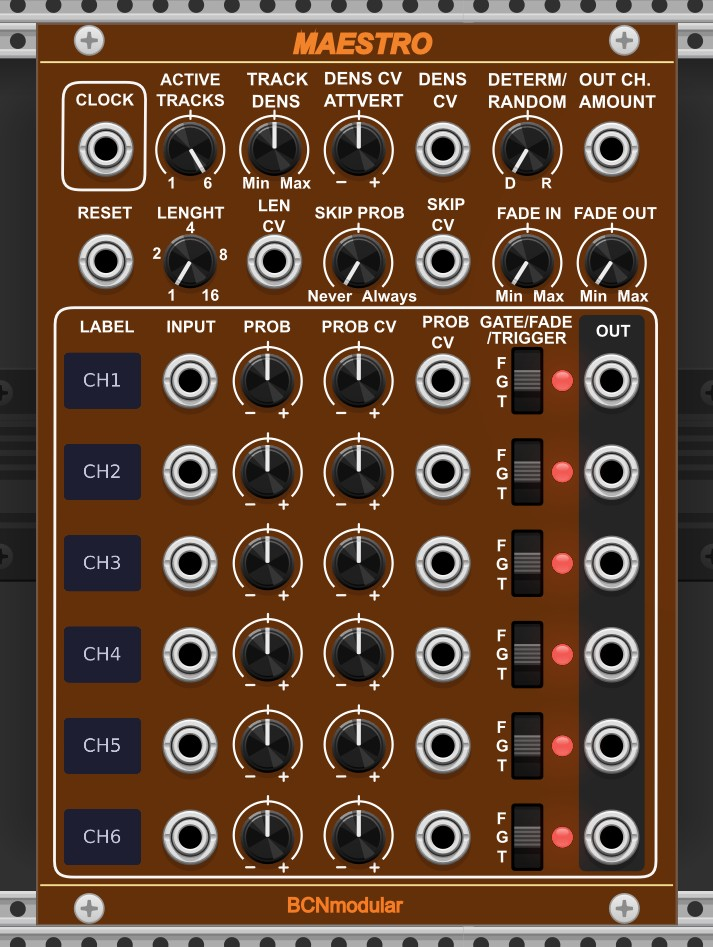

# BCNmodular

VCV Rack plugins by BCNmodular (Barcelona, Catalonia, SPAIN).

By Santi Fort

## Maestro



**Probabilistic Voice Router, Arranger, Mixer, Sequencer & Trigger Generator**

Maestro is an arrangement tool for VCV Rack that brings controlled randomness to your patches. Instead of building fully deterministic sequences, Maestro acts as an intelligent conductor, deciding which voices play at each moment based on weighted probability, density control, and musical timing.

### The concept

In modular synthesis, achieving musical structure while preserving randomness typically requires combining many modules. Maestro consolidates this into a single module: connect your voices, set their relative probabilities, and let Maestro decide who plays at each evaluation point.

### Features

- **6 independent channels** gate, clock, audio or trigger signals
- **Three channel modes** Trigger (T), Gate (G) and Fade (F) selectable per channel
- **Weighted probability per channel** each channel has its own probability knob and CV input with attenuverter
- **Density control** set how many voices are active at once, with CV modulation and attenuverter
- **Randomness control** from fully deterministic (exact number of voices) to fully random (gaussian distribution)
- **Bar-based evaluation** evaluations happen every N bars (1, 2, 4, 8, 16), not beats
- **Skip probability** chance of keeping the current state instead of re-evaluating
- **Fade In / Fade Out** smooth transitions for audio channels (0 to 10s)
- **Polyphonic support** all channels process polyphonic signals
- **Channel labels** editable 4-character labels per channel (double-click to edit)
- **Reset input** resets the bar counter or forces an immediate evaluation
- **Active voices CV output** CV proportional to the number of active voices
- **RGB LEDs** color-coded status per channel and mode
- **Voltage indicator** output jacks show signal level

### Channel modes (T/G/F switch)

Each channel has an independent mode switch:

| Mode | Description |
|------|-------------|
| T (Trigger) | Sends a short pulse (configurable 1 to 10ms) at 10V when the channel is selected. LED is blue when waiting, flashes white on trigger |
| G (Gate) | Instant on/off. Passes the input signal while the channel is active |
| F (Fade) | Smooth fade in and fade out (0 to 10s). Ideal for audio signals |

### LED colors

| Color | Meaning |
|-------|---------|
| Blue | Channel in Trigger mode, waiting |
| White flash | Trigger fired |
| Green | Channel active (Gate or Fade mode) |
| Yellow | Fade transition in progress |
| Red | Channel inactive (Gate or Fade mode) |

### Context menu options

- **Beats per bar** set time signature (2 to 8 beats per bar, default 4)
- **Min active voices** set a minimum number of active voices to prevent full silence
- **Default input voltage** select 1V (gate/trigger) or 10V (CV/audio) for unconnected inputs
- **Active output CV mode** proportional to active tracks, or absolute (1.66V per voice)
- **Trigger duration** configurable pulse length: 1ms, 2ms, 5ms (default) or 10ms
- **Skip CV mode** Probabilistic (CV sets probability) or Binary (CV acts as on/off)
- **Skip mode** Global (skip entire evaluation) or Per channel (each channel decides independently)
- **Reset input mode** Reset bars (resets bar counter) or Force evaluate (triggers immediate evaluation without resetting the counter)

### Controls

#### Global (Row 1)
| Control | Description |
|---------|-------------|
| CLOCK | Clock/trigger input drives the beat counter |
| ACTIVE TRACKS | Number of channels participating in evaluation (1 to 6) |
| TRACK DENS | Base number of active voices |
| DENS CV ATTVERT | Attenuverter for density CV (bidirectional) |
| DENS CV | CV input for density modulation |
| DETERM/RANDOM | Randomness amount (left = deterministic, right = random) |
| OUT CH. AMOUNT | CV output proportional to active voices (0 to 10V) |

#### Timing (Row 2)
| Control | Description |
|---------|-------------|
| RESET | Resets bar counter or forces evaluation (see context menu) |
| LENGTH | Evaluation period in bars (1, 2, 4, 8, 16) |
| LEN CV | CV input for length (overrides knob) |
| SKIP PROB | Probability of skipping an evaluation (0 = never, 1 = always) |
| SKIP CV | CV input for skip probability (overrides knob) |
| FADE IN | Fade-in time for audio channels (0 to 10s) |
| FADE OUT | Fade-out time for audio channels (0 to 10s) |

#### Per channel (x6)
| Control | Description |
|---------|-------------|
| LABEL | Editable 4-character channel name (double-click) |
| INPUT | Signal input: gate, clock, audio or trigger source |
| PROB | Base probability for this channel |
| PROB CV ATTVERT | Attenuverter for probability CV |
| PROB CV | CV modulation for probability |
| T/G/F | Mode switch: Trigger, Gate or Fade |
| LED | RGB status indicator (see LED colors above) |
| OUT | Signal output |

### Typical use cases

**Arrangement tool** Connect sequencers or voice outputs to Maestro's inputs. Use CLOCK from your master clock and set LENGTH from 1 to 16 bars. Maestro will periodically decide which voices are active, creating evolving arrangements that never repeat exactly.

**Performance tool** Automate DENSITY with a slow LFO, any evolving signal generator, or MIDI CC to gradually bring voices in and out. Use the attenuverter to control how much the CV affects the density in real time. Use RESET in Force evaluate mode to manually trigger a new arrangement at any moment.

**Trigger sequencer** Set channels to Trigger mode and leave inputs unconnected. Maestro will fire 10V trigger pulses to burst generators, envelopes, or any trigger-sensitive module. Use Skip per channel mode for independent probability per trigger lane.

**Gate sequencer** Leave inputs unconnected (defaults to 1V) and use outputs in Gate mode to trigger gates, switches, or other modules. Maestro acts as a probabilistic relay.

**Mixer** Connect audio signals and use Fade mode with longer fade times for smooth crossfades between voices. Without input signal, the output can also control an external mixer or any voltage controlled module.

### Tips

- Set DETERM/RANDOM fully left for exact voice counts, fully right for maximum variation
- Use MIN ACTIVE VOICES in the context menu to avoid complete silence (if all voices are controlled by MAESTRO)
- In 3/4 time, set Beats per bar to 3 in the context menu
- Longer FADE OUT times preserve natural reverb tails when closing audio channels
- The ACTIVE CV output can feed back into DENSITY CV (with attenuverter) for self-regulating patches
- Use RESET in Force evaluate mode during performance to manually change the arrangement at any moment
- In Trigger mode, set trigger duration to 10ms for modules that need longer pulses (context menu)
- Skip per channel mode combined with individual PROB knobs gives independent probability to each trigger lane

### Changelog

#### v2.1.0
- Added Trigger mode (T) per channel: sends a 10V pulse when selected
- RGB LEDs: blue = trigger mode, white flash on trigger, green = open, yellow = fading, red = closed
- Configurable trigger duration: 1ms, 2ms, 5ms (default), 10ms via context menu
- Skip mode: Global or Per channel (context menu)
- Skip CV mode: Probabilistic or Binary (context menu)
- Reset input mode: Reset bars or Force evaluate (context menu)
- Fixed: simultaneous triggers now fire correctly on all selected channels

#### v2.0.0
- Initial public release

### Building from source

```bash
# Clone the repository
git clone https://github.com/santifort-commits/BCNmodular.git
cd BCNmodular

# Set your Rack SDK path
export RACK_DIR=/path/to/Rack-SDK

# Build
make -j$(nproc)
```

### License

GPL-3.0-or-later, see [LICENSE](LICENSE) for details.

### Author

Santi Fort
BCNmodular, Barcelona, Catalonia
https://github.com/santifort-commits/BCNmodular
